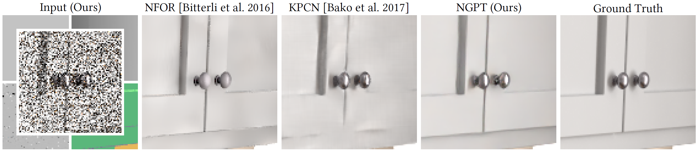

## Deep Convolutional Reconstruction for Gradient-Domain Rendering



<p align="justify"><b>Figure 1:</b> <i>
Comparison of the primal-domain denoisers <a href="https://doi.org/10.1111/cgf.12954">NFOR [Bitterli et al. 2016]</a> and <a href="https://doi.org/10.1145/3072959.3073708">KPCN [Bako et al. 2017]</a> to our gradient-domain reconstruction NGPT from very noisy equal-time inputs (8 samples for ours and 20 for others). Generally outperforming the comparison methods, our results show that gradient sampling is useful also in the context of non-linear neural image reconstruction, often resolving e.g. shadows better than techniques that do not make use of gradients.</i></p>
 
This repository contains the implementation of the algorithm NGPT (Neural Reconstruction for Gradient-Domain Path Tracing) proposed in the following paper:<br><br>

> **Deep Convolutional Reconstruction for Gradient-Domain Rendering**<br>
> Markus Kettunen (Aalto University), Erik Härkönen (Aalto University), Jaakko Lehtinen (Aalto University, NVIDIA)<br>
> https://doi.org/10.1145/3306346.3323038
>
> <p align="justify"><b>Abstract:</b> <i>
>It has been shown that rendering in the gradient domain, i.e., estimating finite difference gradients of image intensity using correlated samples, and combining them with direct estimates of pixel intensities by solving a screened Poisson problem, often offers fundamental benefits over merely sampling pixel intensities. The reasons can be traced to the frequency content of the light transport integrand and its interplay with the gradient operator. However, while they often yield state of the art performance among algorithms that are based on Monte Carlo sampling alone, gradient-domain rendering algorithms have, until now, not generally been competitive with techniques that combine Monte Carlo sampling with post-hoc noise removal using sophisticated non-linear filtering.</i></p>
>
> <p align="justify"><i>
>Drawing on the power of modern convolutional neural networks, we propose a novel reconstruction method for gradient-domain rendering. Our technique replaces the screened Poisson solver of previous gradient-domain techniques with a novel dense variant of the U-Net autoencoder, additionally taking auxiliary feature buffers as inputs. We optimize our network to minimize a perceptual image distance metric calibrated to the human visual system. Our results significantly improve the quality obtained from gradient-domain path tracing, allowing it to overtake state-of-the-art comparison techniques that denoise traditional Monte Carlo samplings. In particular, we observe that the correlated gradient samples – that offer information about the smoothness of the integrand unavailable in standard Monte Carlo sampling – notably improve image quality compared to an equally powerful neural model that does not make use of gradient samples.</i></p>


## Acknowledgments

We thank Sampo Rask, Marco Dabrovic, Blendswap users Jay-Artist, Wig42, SlykDrako, Mareck, nacimus and NovaZeeke for the scenes used in this work, and Benedikt Bitterli and Tiziano Portenier for converting many of them to the Mitsuba format. This work was created using the computational resources provided by the Aalto Science-IT project, and was partially supported by the Academy of Finland (grant 277833).


## Resources

All material related to our paper is available via the following links:

* [Paper Homepage (Open Access)](https://doi.org/10.1145/3306346.3323038)

* [Supplemental Material](../../releases/download/Downloads/ngpt-supplemental.zip)

* [Presentation Slides](../../releases/download/Downloads/ngpt-sig2019.pptx)

This readme is split in two parts, and the text often refers to the [more detailed part](./readme-detailed.md) for details.

## Licenses

The main NGPT reconstruction code in directory 'reconstruct/' is licensed under a BSD 2-Clause License. See [Full License Information](./readme-detailed.md#full-license-information) for the exact license and for the licenses of other included material.


## System Requirements

The reconstruction code requires Python 3.6 or newer and TensorFlow 1.12 or newer, compiled with GPU support. The following modules are also required: OpenEXR, psutil, imageio.

We recommend [Miniconda](https://docs.conda.io/en/latest/miniconda.html) for easier installation of the modules. See [Installing the Python Modules](./readme-detailed.md#installing-the-python-modules).


## Running the Network

To run NGPT, first render a scene with the provided Mitsuba build and then run the reconstruction code in Python.

* Download our [pre-configured scenes](https://doi.org/10.5281/zenodo.3588482) (2.5 GB) into directory 'run_on_cluster/run/scenes'. See [Provided Datasets and Scenes](./readme-detailed.md#provided-datasets-and-scenes).
* A Mitsuba executable can be found in 'run_on_cluster/run/dist/mtsgui.exe'.
* Use the 'Gradient-Domain Path Tracer' plugin, the 'independent' or 'deterministic' sampler, and the 'box' filter to render the scene '/path/to/scene/scene.xml'. Other configurations may require retraining.
* Run ```python run_single_mitsuba.py --config=100 --reconstruct=/path/to/scene/scene.xml``` in directory 'reconstruct/'.

This outputs the reconstruction as '/path/to/scene/scene-100_ngpt_elpips_sqz.exr' along with the NPZ And PNG versions. The config number 100 means the pre-trained default configuration as defined in 'config.py', trained with gradients and the E-LPIPS (SqueezeNet) loss. See [Testing with the Pre-Trained Networks](./readme-detailed.md#testing-with-the-pre-trained-networks) for details.

See [List of Pre-Trained Networks](./readme-detailed.md#list-of-pre-trained-networks) for other provided network configurations.


## Retraining the Network

We provide pre-rendered datasets for training and testing along with scene descriptions for recreating the datasets. The training datasets consist of 250 pieces of random 128x128 crops each, each crop rendered with five different sample counts. The scenes and the compressed datasets can be found at [Provided Datasets and Scenes](./readme-detailed.md#provided-datasets-and-scenes).

See [Retraining the Model](./readme-detailed.md#retraining-the-model) for information on retraining.


## Evaluating the Results

This distribution contains code for evaluating the network performance on a constant dataset. The code evaluates the L1, L2, RelMSE, and E-LPIPS metrics, of which the E-LPIPS numbers typically provide the best prediction for human opinion. See [Testing and Evaluating the Models](./readme-detailed.md#testing-and-evaluating-the-models).


## Re-creating the Datasets

Further development of the models may require recreating the datasets with a modified version of Mitsuba. See [Creating Datasets](./readme-detailed.md#creating-datasets) in the detailed readme for more instructions.
